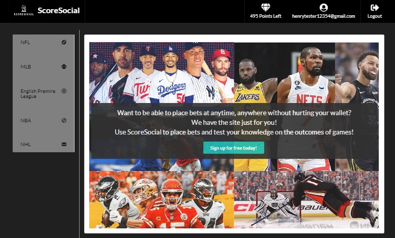
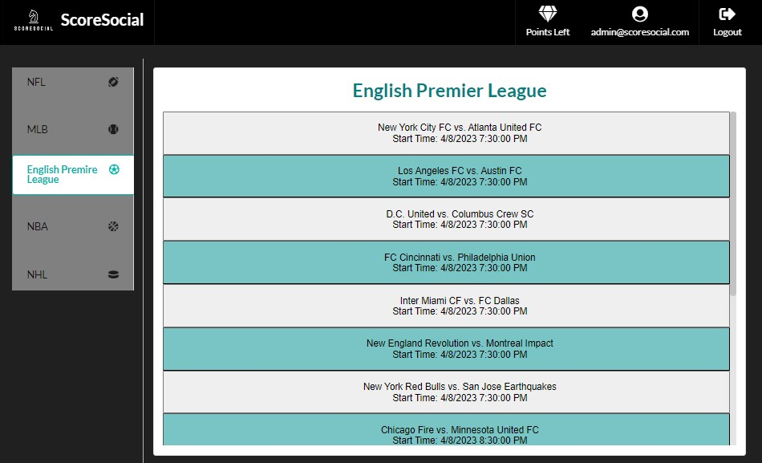
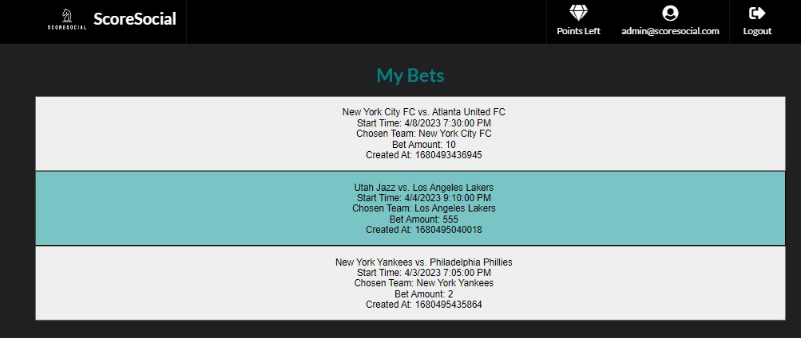

# ScoreSocial

## Description
The ScoreSocial application was built using the MERN stack, with a React front end, MongoDB database, and Node.js/Express.js server and API. When using ScoreSocial, the user can preview games across five different leagues, view the odds of the games, and by using a point system, place bets to increase or decrease the total points.

## Table of Contents

- [Installation](#installation)
- [Usage](#usage)
- [License](#license)
- [Contributing](#contributing)

## Installation
To install our project use the following link: https://github.com/dianavw8/ScoreSocial and follow these simple directions:

Above the list of files, click on the "Code" button.

Copy the URL for the repository.

Open Git Bash.

Change the current working directory to the location where you want the cloned directory.

Type git clone, and then paste the URL you copied earlier.

Press Enter to create your local clone.

For more help and information achiving this, check out the following website: https://docs.github.com/en/repositories/creating-and-managing-repositories/cloning-a-repository

## Usage
The refactored website can be found at: https://mighty-cliffs-23244.herokuapp.com/

The following image demonstrates the application's appearance and functionality on the homepage:

The following image demonstrates the application's appearance and functionality of the sports leagues available to bet on:

The following image demonstrates the application's appearance and functionality of the users bets (current and past history)  :

## License

MIT License link: https://github.com/babel/babel/blob/master/LICENSE

## Contributing

The following are contributers to the making of the ScoreSocial project:

https://github.com/hayesejasmine

https://github.com/SimKat123

https://github.com/vargasdm

https://github.com/bmfoster5

https://github.com/LBissette

https://github.com/dianavw8

